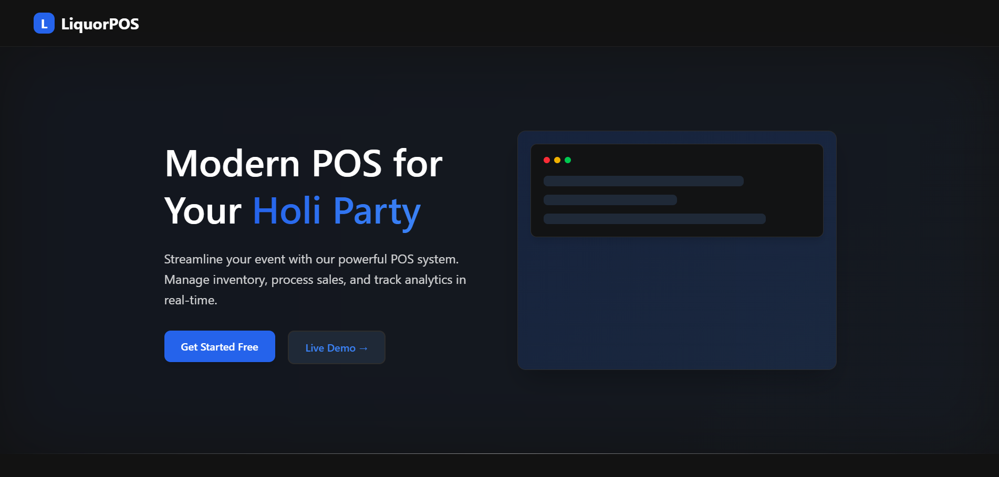

# 🍾 Liquor Management System (LiquorPOS)



A modern **liquor inventory and sales management system** built using **Next.js 15** and **Supabase**. LiquorPOS helps event organizers and store owners **manage stock, track sales, and process orders efficiently** with an intuitive dashboard.

## ✨ Features

✅ **Inventory Management** - Track liquor stock levels in real-time 🔥  
✅ **Point of Sale (POS)** - Process transactions quickly with an intuitive UI 💳  
✅ **Sales Analytics** - View revenue, best-selling products, and low-stock alerts 📊  
✅ **User Authentication** - Secure login and signup using Supabase 🔐  
✅ **Dark Mode UI** - Sleek and modern user interface with a dark theme 🌙  
✅ **Mobile Responsive** - Fully optimized for desktops, tablets, and mobile devices 📱  

## 🏗️ Tech Stack

- **Frontend:** Next.js 15, React, Tailwind CSS
- **Backend:** Supabase (Auth, Database, Storage)
- **Charts & Analytics:** Recharts, Chart.js
- **UI Animations:** Framer Motion

## 📸 Screenshots

### Dashboard


### POS System


### Inventory


## 🗄️ Database Schema

Here is the database schema used for LiquorPOS:


| Table Name      | Description |
|----------------|------------|
| `categories`   | Stores liquor categories with descriptions |
| `inventory`    | Tracks liquor stock levels, pricing, and supplier details |
| `orders`       | Stores customer orders, payment details, and total amounts |
| `order_items`  | Links individual liquor products to orders for itemized billing |
| `profiles`     | Manages user profiles, roles, and authentication details |


## 🚀 Getting Started

### 1️⃣ Clone the Repository
```bash
git clone https://github.com/your-username/liquor-management.git
cd liquor-management
```

### 2️⃣ Install Dependencies
```bash
npm install  # or yarn install
```

### 3️⃣ Setup Environment Variables
Create a `.env.local` file and add your **Supabase credentials**:
```env
NEXT_PUBLIC_SUPABASE_URL=your_supabase_url
NEXT_PUBLIC_SUPABASE_ANON_KEY=your_supabase_key
```

### 4️⃣ Run the Development Server
```bash
npm run dev  # or yarn dev
```
Access the app at **[LiquorPOS](https://liquor-pos.vercel.app/)**

## 🎯 Roadmap
- [ ] Implement role-based access control (Admin, Cashier) 🛂
- [ ] Add AI-powered sales forecasting 🤖
- [ ] Export sales reports as PDFs 📄

## 🙌 Contributing
Pull requests are welcome! If you'd like to contribute, please **fork the repository** and submit a PR. For major changes, please open an issue first.

## 📜 License
This project is **MIT Licensed**. Feel free to use and modify it as needed.

---
🔗 **Follow Me:** [GitHub](https://github.com/saumyadesai17) | [LinkedIn](https://www.linkedin.com/in/saumya-desai-42757328a/)
